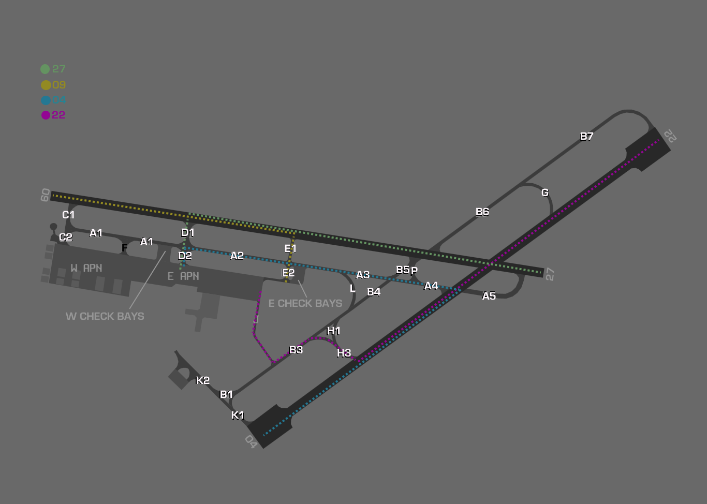
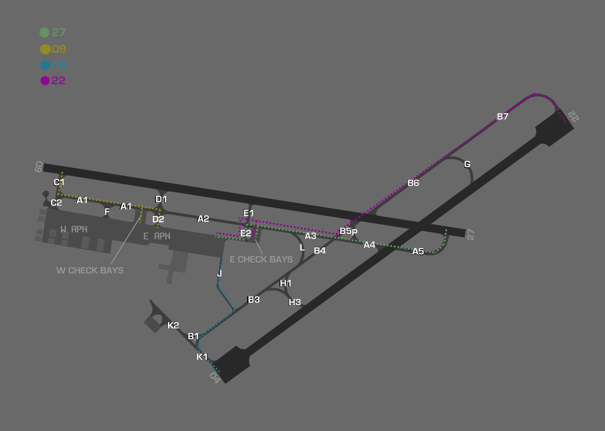

--8<-- "includes/abbreviations.md"

## Positions

| Name               | Callsign           | Frequency        | Login ID             |
| ------------------ | --------------     | ---------------- | -----------------------------|
| **East Sale ADC**      | **Sale Tower**    | **118.300**          | **ES_TWR**                       |
| **East Sale SMC**      | **Sale Ground**   | **127.250**          | **ES_GND**                       |
| **East Sale ACD**      | **Sale Delivery** | **134.100**          | **ES_DEL**                       |
| **East Sale ATIS**     |                    | **125.40**           | **YMES_ATIS**                    |

## Airspace
ES ADC owns no airspace. Release may be available from ES APP for circuits.

## Maneuvering Area
### Standard Taxi Routes
| Runway     | Outbound Route                   | Inbound Route                   |
| ---------- | -------------------------------- | --------------------------------|
| Runway 27  | E2 or Eastern Check Bays         | D2                              |
| Runway 09  | D2 or Western Check Bays         | E2                              |
| Runway 22  | E2 or Eastern Check Bays         | J                               |
| Runway 04  | J                                | D2                              |

<figure markdown>
{ width="700" }
<figcaption>Inbound Taxi Routes</figcaption>
</figure>

<figure markdown>
{ width="700" }
<figcaption>Outbound Taxi Routes</figcaption>
</figure>

## Local Procedures 
### Flight Category
Recovering military aircraft must automatically revert to VFR at the following points:

- At the initial point when recovering via military stream landing pattern (initial and pitch)
- At Hi-Key
- Following a touch and go, go-around, or visual overshoot when a local IFR aircraft has indicated an intention to join the circuit

### Lanes
The 16 individual training areas within the ESL military airspace are separated by 4 outbound lanes. These lanes are used by aircraft transiting to/from exterior training areas or for entry and exit of ESL military airspace.

Lanes are defined by GNSS waypoints situated at 12, 35, and 50 NM from YMES AD.

### Outbound Lanes
| Lane Direction | 12NM GNSS Waypoint | 35NM GNSS Waypoint | 50NM GNSS Waypoint | Bearing |
| -------------- | ------------------ | ------------------ | ------------------ | ------- |
| Northern       | LEKEM              | GONEB              | LANOS              | 359     |
| Eastern        | VEMDA              | KADRU              | TAVET              | 090     |
| Southern       | SABAX              | LUTUK              | NOLOX              | 180     |
| Western        | DUGAD              | LERKO              | DUNNE              | 270     |

Lanes extend from `SFC` or the base of restricted airspace to `F160`. Aircraft departing ESL military airspace may be instructed to track via a lane at or below `F160`.

!!! phraseology
    *BRCT21 is departing East Sale via the Eastern Lane at FL110 to YORB*  
    **ES SMC** -> **BRCT21**: "BRCT21 cleared to YORB via Eastern Lane, flight plan route, climb to F110, squawk 5072, departure frequency 123.3"

## Helicopter Operations
### Circuits  
When RWY09/27 is being used for fixed-wing circuit training, it is preferred that helicopters utilise the threshold of runway 04 (runway 09/27 direction) for landing and take-off to increase segregation between final approach and upwind segments. When helicopters require use of TWY A (Pad Alpha) for circuit training, base turns should be sequenced to avoid conflict during the final approach segment.

## Runway Modes
### Preferred Runway Modes
Winds must always be considered for Runway modes (Crosswind <20kts, Tailwind <5kts). Only single runway operations are approved.

| Mode | Arrivals  | Departures |
| ----------------| --------- | ---------- |
| 04 Only | 04 | 04 |
| 09 Only | 09 | 09 |
| 22 Only | 22 | 22 |
| 24 Only | 24 | 24 |

### Circuit Procedures
The East Sale Circuit Area (ESL CIRA) is active at all times when R360A is active.

Circuit operations occur within a `5NM` radius of ESL ARP, at the following altitudes:

<table>
  <thead>
    <tr>
      <th>Type</th>
      <th>Normal Altitude</th>
      <th colspan="2">Low Level Altitude</th>
    </tr>
    <tr>
      <th></th>
      <th></th>
      <th>Day</th>
      <th>Night</th>
    </tr>
  </thead>
  <tbody>
    <tr>
      <td>Non Jet</td>
      <td>A010</td>
      <td>A004</td>
      <td>Circling Minima</td>
    </tr>
    <tr>
      <td>Jet</td>
      <td>A015</td>
      <td>A006</td>
      <td>Circling Minima</td>
    </tr>
  </tbody>
</table>

No more than the following aircraft shall be permitted to operate in the circuit area at any one time:

| | ESL Day | ESL Night | WSL Day | WSL Night |
| ------ | ------- | --------- | ------- | --------- |
| Aircraft Count    | 6       | 5         | 5       | 5         |

#### Circuit Direction
| Runway | Direction |
| ------ | ----------|
| 09     | Left      |
| 22     | Left      |
| 04     | Right     |
| 27     | Right     |

#### Low Approach
By day, pilots of local aircraft may request a low approach. Pilots are responsible for ensuring that no collision risk exists and that there is suitable spacing to continue the approach and for the potential/subsequent go-around.

## Coordination
### Auto Release
[Next](../../controller-skills/coordination.md#next) coordination is required from ES ADC to ESA for all aircraft.

The Standard Assignable Level from  **ES ADC** to **ESA** is:

| Aircraft | Level |
| -------- | ----- |
| Fixed-wing | The lower of `F160` and `RFL` |
| Rotary-wing | The lower of `A040` and `RFL` |

Helicopters departing from helicopter spots will be treated as if departing from the duty runway.

!!! phraseology
    *PSDN14 is a VFR helicopter departing from the threshold of RWY04 (in the direction of runway 27)*  
    **ES ADC** -> **ESA**: "Next, PSDN14, runway 27"  
    **ESA** -> **ES ADC**: "PSDN14, right turn, unrestricted"  
    **ES ADC** -> **ESA**: "Right turn, PSDN14" 

## Charts
!!! abstract "Reference"
    Additional charts to the AIP may be found in the RAAF TERMA document, available towards the bottom of [RAAF AIP page](https://ais-af.airforce.gov.au/australian-aip){target=new}