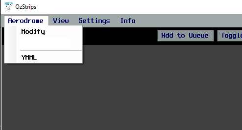
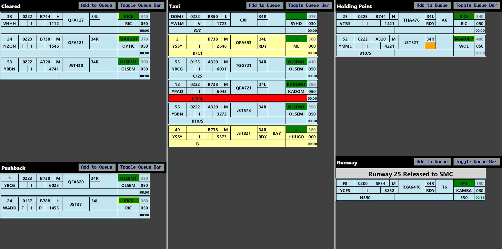
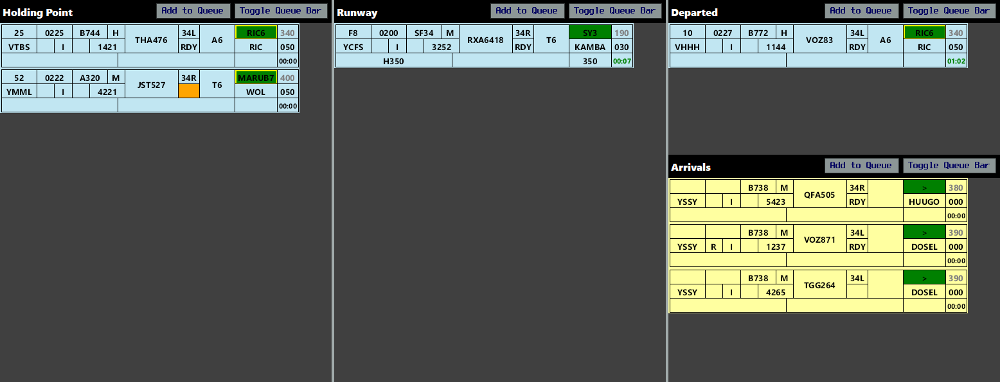
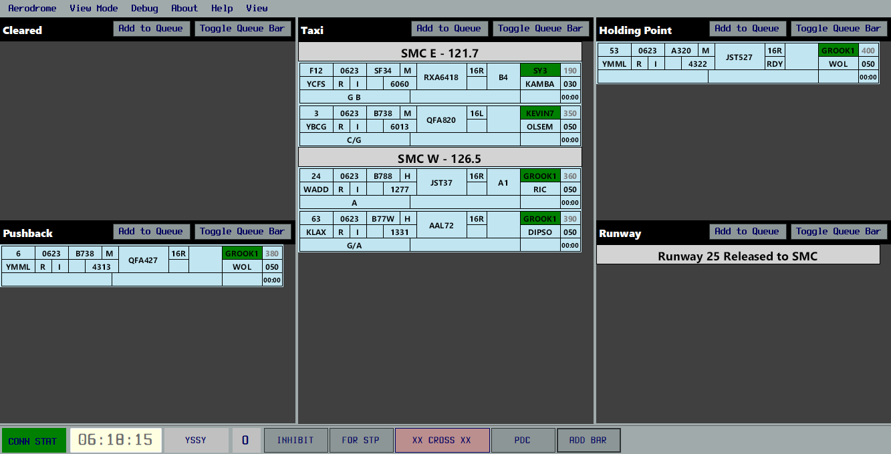

--8<-- "includes/abbreviations.md"

In the real world, aerodrome controllers use strips to provide a visual representation of aerodrome activity, beyond what looking out the window or at a radar screen can provide.

Within vatSys, this can be emulated using the [OzStrips plugin](https://maxrumsey.xyz/OzStrips/){target=new}. Strip state is shared between controllers operating at the same aerodrome.

!!! warning "Important"
    OzStrips can be an incredibly useful tool to reduce controller workload and improve the level of service offered to pilots, but it's use is not compulsory. Controllers should revert to the default vatSys strip bays if the use of OzStrips is becoming a hinderance to themselves or surrounding controllers.

## Setup
### Installation
The OzStrips plugin can be downloaded using the [vatSys Plugin Manager](https://github.com/badvectors/PluginManager){target=new}.  

If the client is installed correctly, there will be an *OzStrips* option in the Window dropdown menu.

<figure markdown>
{ width="700" }
</figure>

### Connecting
After logging onto the network, open the plugin from the dropdown menu, and select the desired aerodrome, or type the ICAO code into the text field.

<figure markdown>
{ width="500" }
</figure>

A connection attempt will be made and if successful, the *CONN STAT* field in the Control Bar will turn green.

### Configuring Views
Once connected to the relevant aerodrome, controllers should select the view mode which is most suitable for their position. Use the **View Mode** menu item to select a layout.

<figure markdown>
{ width="250" }
</figure>

The size of each strip can be adjusted using the **Strip Scale** slider, under **Help** > **Settings**. Users with limited screen realestate may benefit from using a smaller strip size.

The plugin window will adjust to being resized, automatically collapsing into a two and single column layout, which is helpful for users with small screens.

<figure markdown>
{ width="450" }
</figure>

By default, the height of each strip bay is fixed, however using the **Smart Resize** functionality, they can be set to a dynamic height based on the number of strips in each bay. This is helpful when using the plugin in a collapsed column layout or with limited screen height.

<figure markdown>
{ width="500" }
</figure>

## Stripboard
<figure markdown>
{ width="800" }
</figure>

The stripboard is divided into multiple bays, each representing a stage in an aircraft's flight thread.

Strips can be moved in between strip bays by clicking on their callsign, and clicking the bay where you want them to go. Strips can be moved to the next bay by clicking on the SID box (referred to as *SID triggering*).

Selecting a track on the Ground Radar or ASD will select the relevant strip in OzStrips, and vice versa.

!!! Note
    Strips can not be *SID triggered* from the **Holding Point Bay** to the **Runway Bay**, to prevent accidental placement onto the runway.

### Control Bar 
The bottom of the window holds the Control Bar. This panel contains the server connection status, aerodrome selected and ATIS code among other elements. 

Each button has the following function:

| Button | Function |
| ------ | -------- |
| **INHIBIT** | Removes a strip from the stripboard (used when a strip is no longer needed) |
| **FOR STP** | Creates a strip on the stripboard for the selected aircraft (vatSys FDR must be selected before pressing button) |
| **XX CROSS XX** | Adds a red highlight to the selected strip, denoting a clearance to cross a runway |
| **PDC** | Opens the default vatSys PDF editor |
| **ADD BAR** | Allows controllers to place a variety of fixed bars anywhere on the stripboard, reflecting status changes (e.g. autorelease cancellation or runway crossing) and allowing additional queues to be build (e.g. Sydney Coordinator functions) |

!!! Note
    PDCs through OzStrips are sent via Private Message. To send a PDC through [vatACARS](./cpdlc.md), you'll be required to dispatch it manually.

### Strips
The background colour of the strip corresponds to its status as an arrival or a departure. Departing aircraft have a blue strip, while arrivals have a yellow strip.

<figure markdown>
{ width="600" }
</figure>

| Number | Content | Left Click | Right Click |
|---------|-------------|--------------| ----------- |
| **1** | **Bay Number** | Edit Bay Number | |
| **2** | **Filed Off Blocks Time** | Cock Strip | |
| **3** | **Aircraft Type** | Open Flightplan | |
| **4** | **Wake Turbulence Category** | | |
| **5** | **Destination** | Open Flightplan | |
| **6** | **Route Indicator** | Show Route | |
| **7** | **Flight Rules** | | |
| **8** | **Correct SSR Code + Mode C Received** | | |
| **9** | **SSR Code** | Autogenerate Code | |
| **10** | **Callsign** | Select Strip | |
| **11** | **Runway** | Change Runway | |
| **12** | **Ready Flag** | Toggle Ready Flag | |
| **13** | **Holding Point** | Edit Holding Point | |
| **14** | **SID** | Move strip to next bay | Change SID |
| **15** | **First Waypoint** | Open flightplan | Open Reroute Window |
| **16** | **Requested Level** | Open flightplan | |
| **17** | **Cleared Level** | Change CFL | |
| **18** | **vatSys Global Ops Field** | Edit | |
| **19** | **OzStrips Remarks** | Edit | |
| **20** | **Departure Heading** | Edit Departure Heading | |
| **21** | **Takeoff Timer** | Start / Reset | |

<figure markdown>
{ width="600" }
    <figcaption>An example strip</figcaption>
</figure>

## Recommended Workflow
Due to it's shared state, OzStrips works best if all controllers follow a standardised workflow. Controllers are strongly encouraged to follow the workflow below.

### Delivery
Format the strip of recently connected aircraft so that you can identify any problems with their filed flight plan before they request clearance. 

#### Issuing Clearance
When an aircraft requests airways clearance, select the strip to avoid losing it from view, then deliver the clearance. Upon receiving a correct readback, enter the aircraft's parking bay in the Bay field, then move it to the **Cleared Bay**.

If multiple aircraft request clearance at once, [queue](#queue-management) the strips for each aircraft, in the order in which they called.

<figure markdown>
{ width="800" }
    <figcaption>An example of the ACD layout and workflow</figcaption>
</figure>

#### Flight Plan Errors
OzStrips will flag any potentially invalid routes and incorrect hemispherical levels. Hover over a flag to learn more about the error.

<figure markdown>
{ width="500" }
    <figcaption>A potentially invalid level, shown by the red background on the CFL box</figcaption>
</figure>

Right mouse click on the yellow first waypoint box to open the Reroute menu. From here, controllers can select a more compliant route. The [VATPAC Tools](https://vatpac.org/membership-hub/tools){target=new} page can be helpful to double check these routes.

<figure markdown>
{ width="500" }
    <figcaption>A potentially invalid route, shown by the yellow background on the first waypoint box</figcaption>
</figure>

<figure markdown>
{ width="500" }
    <figcaption>A VFR aircraft assigned a SID, shown by the yellow background on the SID box</figcaption>
</figure>

#### Pushback Requests on ACD
When [pushback requests](../controller-skills/grounddelaymanagement.md#pushback-requests-on-acd) are being managed by ACD, the procedures set out in [Coordinator](#coordinator) below shall be followed.

### Coordinator
At locations like [Brisbane](../aerodromes/classc/Brisbane.md#pushback-requests-on-acd), [Melbourne](../aerodromes/classc/Melbourne.md#pushback-requests-on-acd), [Perth](../aerodromes/classc/Perth.md#pushback-requests-on-acd), and [Sydney](../aerodromes/classc/Sydney.md#sydney-coordinator), a Coordinator role is sometimes performed during times of high traffic. See each aerodrome-specific page for the requirements to open and set up the Coordinator position.

!!! note
    At most aerodromes, this duty is performed by ACD (when required), but for simplicity, this section will refer to the controller performing the role as 'Coordinator'.

Once all coordination has been completed and the Coordinator position has been opened, all outbound aircraft must first request pushback or taxi on the Coordinator frequency before being passed to SMC. 

Place a `STANDBY FOR GROUND` [bar](#control-bar) in the **Cleared Bay** queue. Any strips below this bar respresent aircraft who have been instructed to standby for ground on the appropriate SMC frequency. Aircraft who are ready for pushback or taxi, but have not been told to monitor SMC, are placed in the queue, above the Standby for Ground bar.

Ensure that no more than **three** strips are ever present below the Standby for Ground bar. When SMC takes a strip from below the Standby for Ground bar and places it in the **Pushback** or **Taxi Bay**, instruct the aircraft next in line (in the queue but above the Standby for Ground bar) to monitor SMC, and move them below the bar.

<figure markdown>
{ width="800" }
    <figcaption>Coordinator Ops with OzStrips <small>Three aircraft are waiting on the SMC frequency (below the Queue bar), and QFA121 and RXA6416 have both requested push/taxi but are being held on the Coordinator frequency. QFA121 is closer to the bottom, so will be next to be told to standby for SMC.</small></figcaption>
</figure>

### Ground
#### Departures
When a departure is issued pushback, move them to the **Pushback Bay**. If pushback is unable to be given at that time, [queue](#queue-management) the strip in the **Cleared Bay**.

!!! tip
    See [Coordinator](#coordinator) above for the procedure to follow when a Coordinator position is active (or [pushback requests](../controller-skills/grounddelaymanagement.md#pushback-requests-on-acd) are being managed by ACD). Remember that the bottom most aircraft is always the first in line.

When taxi instructions are issued, move the strip to the **Taxi Bay** and enter the relevant instructions in the Global Ops field. When the aircraft is given taxi to the holding point at their assigned departure runway, enter the holding point in the Holding Point field.

As the aircraft approaches the holding point, or when frequency transfer is given to Tower (for international aircraft or new pilots), move the strip to the **Holding Point Bay** and clear the Global Ops field (so ADC can use it for their purposes).

#### Arrivals
As an arriving aircraft vacates the runway, ADC will move the strip from the **Runway Bay** to the **Taxi Bay**. Enter the pilot's nominated parking bay in the Bay field and record any taxi instructions in the Global Ops field.

When an aircraft arrives at their nominated parking position, [inhibit](#control-bar) the strip to remove it from the stripboard.

<figure markdown>
{ width="800" }
    <figcaption>An example of the SMC layout and workflow</figcaption>
</figure>

#### Runway Crossings
For aircraft who need to cross an active runway, first coordinate with ADC, then select the strip and use the [XX CROSS XX](#control-bar) button to highlight it as a runway crossing. ADC will place the `XXX CROSSING XXX` [bar](#control-bar) in the **Runway Bay** to prevent inadvertent takeoff or landing clearances from being issued. Once the aircraft is clear, remove the crossing highlight.

!!! tip
    You can quickly toggle the crossing highlight by selecting an aircraft and pressing `X`.

<figure markdown>
{ width="700" }
    <figcaption>BAW15 instructed to cross runway 27, with the **Runway Bay** blocked out</figcaption>
</figure>

Coordinated runway releases should be recorded by placing a `RUNWAY XX RELEASED TO SMC` [bar](#control-bar) in the **Runway Bay**. There is no need to highlight a taxiing aircraft crossing a runway which has been released to SMC.

<figure markdown>
{ width="700" }
    <figcaption>Runway 27 released to SMC</figcaption>
</figure>

### Tower
#### Departures
When a departing aircraft calls ready, click the Ready flag to denote this on their strip. You can adjust the order of the departure sequence by selecting each strip and using the arrow keys to move them up and down. Strips at the bottom of the bay are first in line. 

!!! tip
    The Ready flag will highlight orange if the aircraft is in the **Holding Point Bay** and the aircraft has not called ready (to prevent inadvertent takeoff clearances being issued).

For aircraft on a radar SID or visual departure, record any assigned heading instructions in the Departure Heading field. This will also populate the Global Ops field automatically.

When an instruction to line up is given, move the strip to the **Runway Bay**. When a takeoff clearance is issued, start the Takeoff Timer.

When the aircraft has been transferred to the Departures controller, move the strip to the **Departed Bay**.

If the TCU suspends autorelease, record this by placing the `AUTORELEASE SUSPENDED` [bar](#control-bar) in the **Runway Bay**.

<figure markdown>
{ width="500" }
    <figcaption>RXA3656 assigned heading 320 with autorelease suspended</figcaption>
</figure>

#### Arrivals
When an aircraft calls you on Tower frequency, click the Ready flag (to show that they are on frequency). When a landing clearance is issued, move the strip to the **Runway Bay**.

After the aircraft vacates the runway, move the strip to the **Taxi Bay**.

!!! tip
    By default, the **Taxi Bay** is not visible in the ADC layout. To move a strip from the **Runway Bay** to the **Taxi Bay**, SID trigger the strip (or use the appropriate keyboard shortcut). This works for *arrivals only*, and departing strips SID trigger to the **Departed Bay**.

<figure markdown>
{ width="800" }
    <figcaption>An example of the ADC layout and workflow</figcaption>
</figure>

#### Runway Crossings
Aircraft who need to cross an active runway will be coordinated by SMC. When approval is given for the runway crossing, place the `XXX CROSSING XXX` [bar](#control-bar) in the **Runway Bay** to prevent inadvertent takeoff or landing clearances from being issued. SMC will highlight the aircraft's strip to denote it as a runway crossing. Once the aircraft is clear, remove the bar.

!!! tip
    You can quickly add a Crossing bar to the **Runway Bay** by pressing `ALT + X`. To remove the bar, select it, then press `BACKSPACE`.

<figure markdown>
{ width="700" }
    <figcaption>BAW15 instructed to cross runway 27, with the **Runway Bay** blocked out</figcaption>
</figure>

Coordinated runway releases should be recorded by placing a `RUNWAY XX RELEASED TO SMC` [bar](#control-bar) in the **Runway Bay**.

<figure markdown>
{ width="700" }
    <figcaption>Runway 27 released to SMC</figcaption>
</figure>

### Multiple ADC/SMC Positions
When multiple ADC or SMC positions are online at a given aerodrome, place divider bars in the relevant bays, allowing each controller to process only the aircraft relevant to them.

<figure markdown>
{ width="800" }
    <figcaption>An example of the SMC layout with custom bars to differentiate between SMC positions</figcaption>
</figure>

!!! tip
    With a strip selected, use `CTRL + UP/DOWN ARROW` to push that strip up or down to the next bar (or queue bar). 

## Workload Management
While the use of OzStrips can aid situational awareness, it is ideal to be used in such a manner that it doesn't negatively impact your productivity.

!!! warning "Important"
    Ensure that you communicate instructions concurrently while you move strips in OzStrips. Don't move strips before you do the action or obtain a readback, incase you get interrupted.

### Cocking Strips
Left clicking on the strip's EOBT will highlight and cock the strip, making it stand out. It is recommended to mark strips this way if there is an outstanding request.

!!! tip
    With a strip selected, pressing `TAB` will cock or uncock it.

### Queue Management
When multiple aircraft have outstanding requests, it is recommended you 'queue up' the strip, by placing it below the queue bar. This can be done quickly by selecting the strip then pressing "Add to Queue". Strips can be moved vertically by pressing the keyboard arrow keys while a strip is selected.

Aircraft at the bottom of the queue are first in line.

When an aircraft is in a queue, make sure the strip's bay location represents its current state. 

!!! example
    An aircraft in a queue for an airways clearance, would remain in the **Preactive Bay**, below the queue bar, not in the **Cleared Bay**.