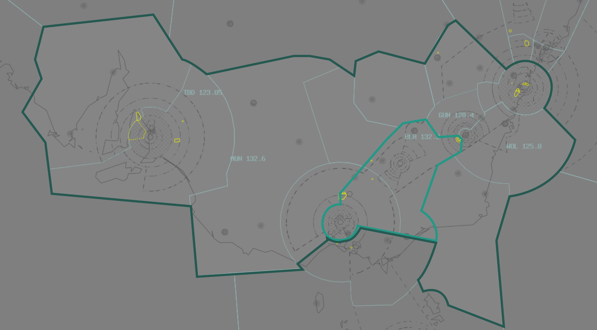
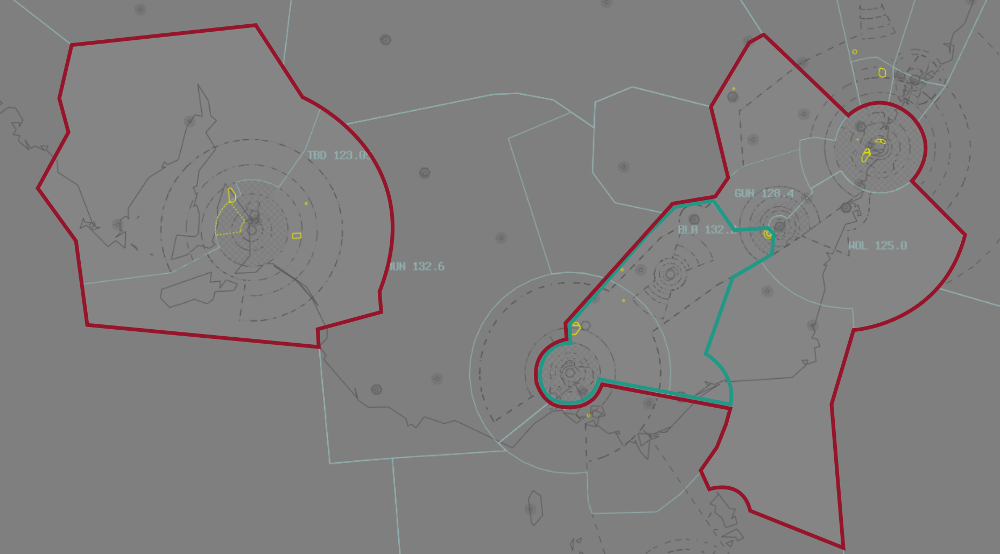
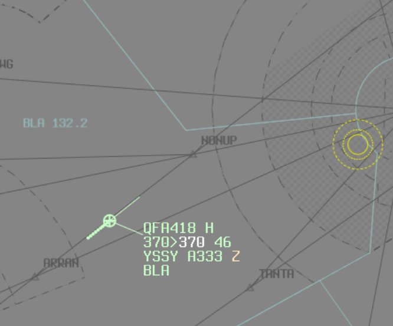

--8<-- "includes/abbreviations.md"

Extended coverage allows a controller to provide wider coverage to pilots during periods of low demand. When offering extended coverage, controllers provide services beyond the boundaries of their primary position, in accordance with the [VATPAC Air Traffic Services Policy](https://vatpac.org/publications/policies){target=new}.

Extending to adjacent sectors **must** be done with consideration of the controllers' [workload](#workload-management) to ensure that the quality of service being offered is not degraded. If, at any time, a controller feels that their ability to provide a quality service is being compromised by the additional workload from the secondary sectors, they must cease providing coverage to secondary sectors to reduce workload.

##Enroute
Enroute controllers are permitted to *extend* to any **four additional sectors**, provided that the resulting pairing forms a **single, continuously adjacent group**. Controllers with at least 150 hours as a C1 may extend to any **six additional sectors**.

In the example below, **BLA** has elected to extend to **TBD**, **GUN**, **MUN**, and **WOL**. The resulting group of sectors forms a single, continuously adjacent group.

<figure markdown>
{ width="800" }
  <figcaption>A compliant group of extended sectors</figcaption>
</figure>

However, should **BLA** they wish to drop **MUN**, they are no longer able to extend to **TBD**, as the sectors no longer form a single, continuously adjacent group.

<figure markdown>
{ width="800" }
  <figcaption>A non-compliant group of extended sectors</figcaption>
</figure>

Controllers must ensure that when extending, they update their visibility points and have sufficient visibility coverage to cover the **entirety** of all sectors under their jurisdiction. If this is not possible (due to range limitations), that sector **must not be extended**. 

##Terminal Area
TCU controllers operating the **[Coral](../../terminal/coral)** or **[Tasmania](../../terminal/tassie)** TMAs may elect to extend to the adjacent TMA (e.g. HBA extend to LTA) at their discretion.

## Frequency Management
When providing extended coverage, controllers must have all the frequencies of the sectors they are extending to **active** and **cross-coupled**. As aircraft pass from one enroute sector to another they must be instructed to change frequency to remain in VHF coverage.

!!! phraseology
    **ISA**: "AAA225, contact me on 120.15."
	
    **ARL**: "FJI923, at waypoint ABARB, contact me on 124.95."
	
    **HYD**: "MXD194, at time 30, contact me on 134.00."	

	
Keep track of the frequency on which an aircraft is monitoring by placing the three letter sector designator in the label. Once an aircraft receives their final frequency change, you can choose to remove the frequency designator from the label.
	
<figure markdown>
{ width="800" }
  <figcaption>An aircraft monitoring the 'BLA' frequency.</figcaption>
</figure>

Controllers may also assist others by putting the frequency designator in the label prior to handing off an aircraft to another ENR controller. eg, controlling **BLA**, transferring aircraft bound for YPAD to **MUN**, who is also extending to **TBD**: Put `MUN` in label prior to handoff.

## Workload Management
It is very easy to start controlling to several adjacent sectors when traffic is calm, have traffic quietly build up until, until all of a sudden, the workload exceeds ones' capacity and becomes overwhelming. This situation is often caused by *'overextending'*: there is simply too much traffic in the area/on frequency for a single controller to manage.

Overextending diminishes the level of service provided to pilots, and all-in-all, makes pilots not want to fly online. 

Controllers should always be proactively considering their workload and monitoring for signs that it may increase shortly, such as:

- Increasing numbers of strips in the Preactive window; 
- Increasing numbers of strips in the Announced window; 
- A significant number of inbound, announced aircraft about to enter the airspace; or
- Unusual flight plans, movements, or other requests that will demand a bit of extra brain-power and attention.

!!! note
	It is considered bad practice for a controller to not relinquish airspace if:
	
	- They have more than 15 Jurisdiction (Green) aircraft; or
	- They have more than 10 Announced (Blue) tracks

Other signs a controller is overextending may include aircraft constantly stepping on each other, or missing radio calls; and if the controller finds themselves not having time to think, or forgetting where aircraft are located when they call up.

!!! warning Important
	It is significantly easier to recognise that you are about to be busy and to do something about it, than it is to realise that you are over capacity and try to fix it. **Don't wait until you're overwhelmed**: recognise the signs early and relinquish airspace *before* things become too much to handle.

## Remarks
When extending, the VATPAC plugin (which is included in the Australia and Pacific profiles by default) will automatically update the controller remarks to include details of extended sectors, in the format: *"Extending to (Sector) (frequency), (Sector) (frequency), etc.* .

!!! example
    Melbourne Centre  
    **Extending to HUO 122.6, MUN 132.6, GUN 128.4**  
    Airspace, Charts, Tools - vats.im/pac/pilot  
	ATC feedback - helpdesk.vatpac.org

!!! example
    Coral Approach  
    **Extending to RKA 123.75**  
    Airspace, Charts, Tools - vats.im/pac/pilot  
	ATC feedback - helpdesk.vatpac.org
	
This has the benefit of: 
 
- Helping pilots be aware of whether or not they are in your airspace, so they are less likely to start taxiing without a clearance or traffic statement.
- Helping pilots know which frequency to use.
- The [VATPAC Coverage map](https://map.vatpac.org/static/map.html) will display sectors based on controllers' active and cross-coupled frequencies.
- [VATSIM Radar](https://map.vatsim.net) will display sectors listed in controllers' remarks, where the formatting above has followed.

!!! note
	The VATPAC plugin will amend your controller remarks to add or remove sectors when a transmitted frequency is added or removed via the VSCS. There is no need for controllers to edit the list manually.