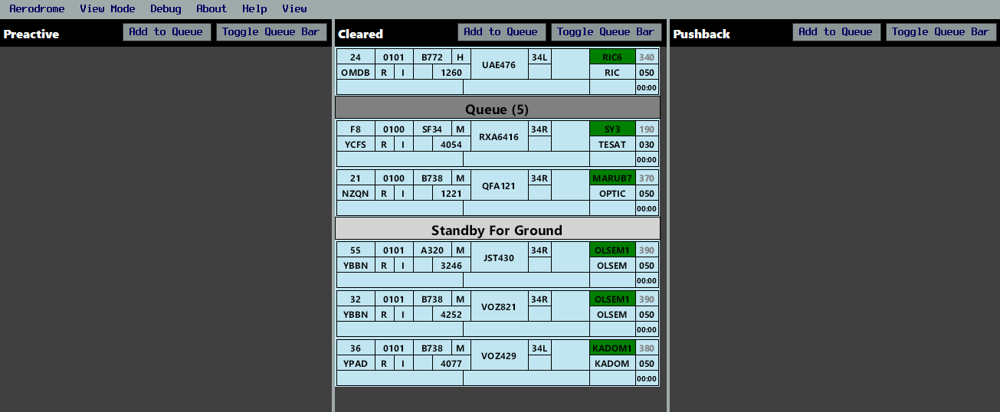

--8<-- "includes/abbreviations.md"

## Overview
Managing the flow of traffic is not just limited to [sequencing](sequencing.md) in the air! Flow Management techniques can be applied to aircraft on the ground to minimise delays in the air and reduce congestion.

In real life, controllers rely on Airport Collaborative Decision Making (A-CDM) to coordinate and plan aircraft movements across the country, and there are multiple dedicated flow controllers and operations analysts to ensure efficiency on a daily basis. On VATSIM we can apply techniques such as pushback management, ground delays, and departure sequencing to evenly distribute workload amongst controllers and to ensure every pilot has an enjoyable experience during our busiest events.

## Pushback Requests on ACD
During busy events, such as [Milk Run Monday](../../../events/milkrun/), the **SMC** controller may end up with a much higher workload than the **ACD** controller. To mitigate this, some airports have local SOPs that allow for pushback requests to be done on **ACD** frequency, to balance the workload. 

!!! note
    The 'Pushback Requests on ACD' procedure is currently limited to [Brisbane](../../aerodromes/classc/Brisbane/#pushback-requests-on-acd), [Melbourne](../../aerodromes/classc/Melbourne/#pushback-requests-on-acd), [Perth](../../aerodromes/classc/Perth/#pushback-requests-on-acd), and [Sydney](../../aerodromes/classc/Sydney/#pushback-requests-on-acd) when Sydney Coordinator is offline (see below).
	

### Sydney Coordinator
At Sydney, a non-standard position of [Sydney Coordinator]((../../aerodromes/classc/Sydney/#sydney-coordinator) is activated to reduce frequency congestion on SMC and ensure compliance with pre-determined slot times. The responsibilities of Sydney Coordinator may be delegated to **ACD** when there is high SMC workload but no seperate Coordinator controller available.

### Implementing Pushback Requests on ACD
A few steps must be followed to properly execute this procedure. To commence the procedure:

1. **SMC** and **ACD** coordinate to implement the procedure, due to high **SMC** workload.
2. **SMC** coordinates with **ADC** in order to have the [ATIS](#acd-pushback-requests) updated.
3. **ACD** places the `STANDBY FOR GROUND` bar in the **Cleared Bay** in [OzStrips](../../client/towerstrips.md#coordinator).

!!! phraseology
    **ML SMC** -> **ML ACD**: "It's getting quite busy. Happy to implement Pushback requests on your frequency?"  
    **ML ACD** -> **ML SMC**: "Understood, affirm"  
    **ML SMC** -> **ML ACD**: "Thanks, I'll talk to Tower"  

    **ML SMC** -> **ML ADC**: "Can we please get `ALL DEPARTURES MUST REQUEST PUSH BACK ON 127.2` on the ATIS?"  
    **ML ADC** -> **ML SMC**: "Wilco"  

To operate with pushback requests on ACD:

1. When **ACD** has finished issuing an airways clearance, they will **remind** pilots to *"Contact me when ready for pushback"*.
2. When a pilot requests pushback, **ACD** will assess their priority based on apron congestion and number of aircraft in the queue (see [Queue Management](#queue-management)).  
3. **ACD** will either instruct them to **standby for Ground** *(not contact)*, or remain on the ACD frequency if a delay is required.  
4. If an aircraft is instructed to 'standby for Ground', **ACD** will move the strip below the **Standby for Ground** bar in the **Queue** section of the **Cleared Bay** in [OzStrips](../../client/towerstrips.md#coordinator), to denote they are awaiting pushback approval.  
5. When **SMC** has adequate space on the aprons, taxiways, and holding point, they will issue pushback/taxi to the next aircraft in line by scanning the [Cleared Queue bay](../../../client/towerstrips/#stripboard).

The decision whether or not to send an aircraft to SMC or hold them on the ACD frequency should be made in accordance with the [Queue Management](#queue-management) techniques.

!!! warning "Important"
    If SMC needs to reduce the pushback rate due to congestion at the holding points or excessive workload, **ACD** should be informed without delay, and instructed to hold all departures on their frequency. This will stop aircraft being told to 'standby for ground' on the SMC frequency. Remember to cancel this requirement when congestion eases.

!!! phraseology
    **VOZ543:** "Melbourne Delivery, VOZ543, PDC read back"  
    **ML ACD:** "VOZ543, Melbourne Delivery"  
    **VOZ543:** "DOSEL1 departure, squawk 1336, bay E8, VOZ543"  
    **ML ACD:** "VOZ543, contact me when ready for pushback"  
    **VOZ543:** "Wilco, VOZ543"  
    ...   
    **VOZ543:** "Melbourne Delivery, VOZ543, bay E8, request pushback"  
    **ML ACD:** "VOZ543, standby for ground 121.7"  
    **VOZ543:** "Standby for ground 121.7, VOZ543"  
    ...   
    **ML SMC:** "VOZ543, Melbourne Ground, pushback approved."

If a delay is required prior to transferring an aircraft to SMC, provide an estimated delay value to the pilot or advise them of their position in the queue.

!!! tip
    Remember that the **bottom** aircraft represents the **front** of the queue.

!!! phraseology
    **VOZ543:** "Melbourne Delivery, VOZ543, bay E8, request pushback"  
    **ML ACD:** "VOZ543, estimated delay 10 minutes, remain this frequency."

### Queue Management
To reduce SMC workload, ACD should not allow more than **three** aircraft to be awaiting pushback or taxi on the SMC frequency. When three aircraft are already queued on the SMC frequency, any additional aircraft should be told to remain on the ACD frequency and informed of their position in the queue or approximate delay (if known). These aircraft should be placed in the **Cleared Bay Queue**, above the **Standby for Ground** bar.

<figure markdown>
{ width="800" }
  <figcaption>Pushback Requests on ACD Ops with OzStrips <small>Three aircraft are waiting on the SMC frequency (below the Queue bar), and QFA121 and RXA6416 have both requested push/taxi but are being held on the ACD frequency. QFA121 is closer to the bottom, so will be next to be told to standby for SMC.</small></figcaption>
</figure>

When SMC moves an aircraft from below the **Standby for Ground** bar to the **Pushback Bay**, ACD should instruct the next aircraft in line to standby for ground on the SMC frequency (and move the strip appropriately).

!!! warning "Important"
    Strips must remain in the strip bay of their **current state**, even if they are in a queue. For example, if they have received an airways clearance and are in the queue for pushback, they must remain in the **Cleared Bay**, **not** the Pushback Bay.
