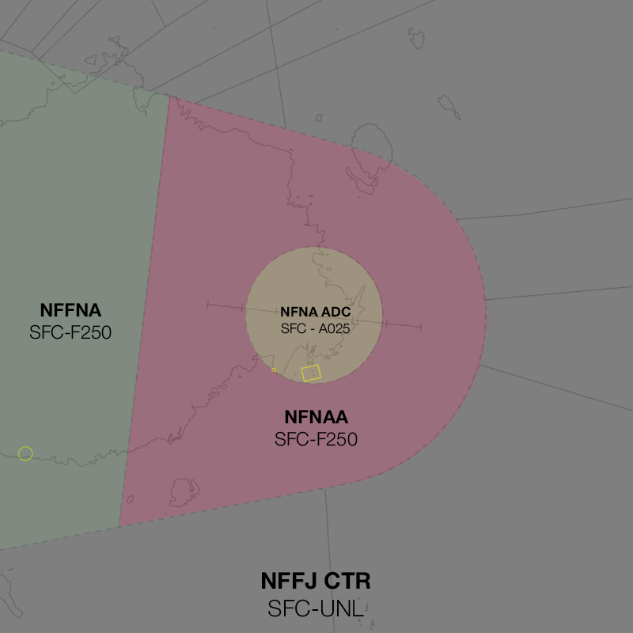

--8<-- "includes/abbreviations.md"

## Positions

| Name                    | Callsign         | Frequency | Login ID    |
| ----------------------- | --------- | ---------------- | --------- |
| **Nausori Approach** | **Nausori Approach** | **119.700**   | **NFNA_APP**  | 

## Airspace
The vertical limits of the NFNA TCU are `SFC` to `F250`. **NFNA ADC** is responsible for the airspace within the NFNA CTR from `SFC` to `A025`.

<figure markdown>
{ width="700" }
  <figcaption>NFNA TCU Structure</figcaption>
</figure>

<!----## Separation--->
## Local Procedures
### Namuka Training Area
The Namuka Training Area is established west of the NFNA CTR, from `SFC` to `A040`, can be activated by NFNAA upon pilot request.

<figure markdown>
{ width="700" }
  <figcaption>Namuka Training Area</figcaption>
</figure>
<!---## Arrival Procedures

## Tower Offline Procedures 

## Runway Modes

## Helicopter Operations

## Flow-->
## Coordination
### Enroute
#### Departures
Voiceless for all aircraft:

- Tracking via a Procedural SID terminus; and
- Assigned the lower of `F240` and `RFL`.

!!! note
    Aircraft are *not required* to be tracking via the **SID procedure**, simply tracking via any of the terminus waypoints (Regardless of *departure airport* or *assigned SID*) is sufficient to meet the criteria for **voiceless coordination**

All other aircraft going to NFFN_CTR CTA must be **Heads-up** Coordinated by NFNAA prior to the boundary.

!!! phraseology
    **NFNAA** -> **NFFN_CTR**: "via ANRIK, FJI281"  
    **NFFN_CTR** -> **NFNAA**: "FJI281"  

#### Arrivals
Voiceless for all aircraft:

- With ADES **NFNA**;
- Tracking via a published airway to **NA VOR**; and
- Assigned `A070`

All other aircraft coming from NFFN_CTR CTA will be **Heads-up** coordinated to NFNAA.

### NFNA ADC
#### Departures
Next coordination is required from NFNA ADC to NFNAA for all aircraft entering **NFNAA CTA**

The Standard Assignable Level from **NFNA ADC** to **NFNAA** is:

| Aircraft | Level |
| -------- | ----- |
| All | The lower of `A040` and `RFL` |

#### Arrivals/Overfliers
NFNAA will heads-up coordinate arrivals/overfliers to NFNA ADC.

IFR aircraft will be cleared for the coordinated approach (Instrument or Visual) prior to handoff to NFNA ADC, unless NFNA ADC nominates a restriction.

VFR aircraft require a level readback.

!!! phraseology  
    **NFNAA** -> **NFNA ADC**: "via FNAWI for the RNP RWY 10, FJA81"  
	**NFNA ADC** -> **NFNAA**: "FJA81, RNP RWY 10"

### NFFNA
All aircraft transiting between NFFNA and NFNAA must be **Heads-up** coordinated.

!!! phraseology  
    **NFNAA** -> **NFFNA**: "via NUNSI, FJA16"  
	**NFFNA** -> **NFNAA**: "FJA16"
	
<!---- ## Charts ---->