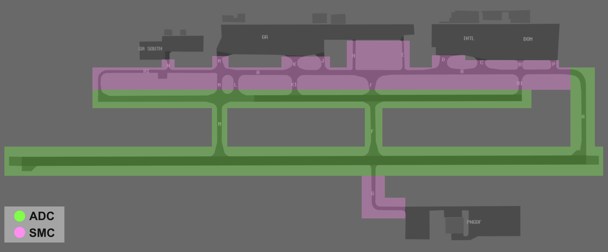
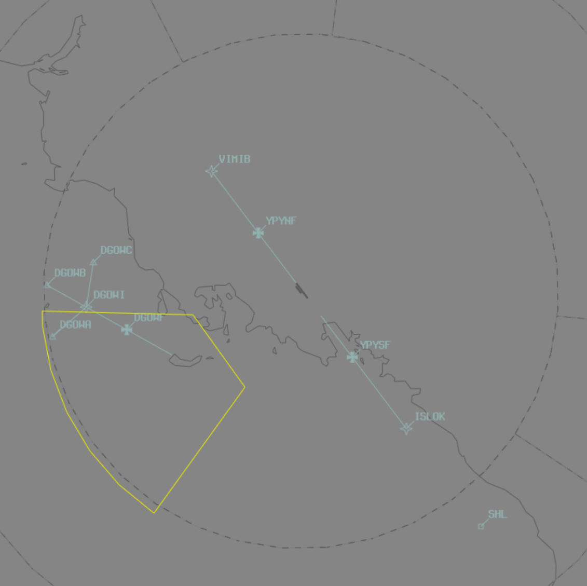
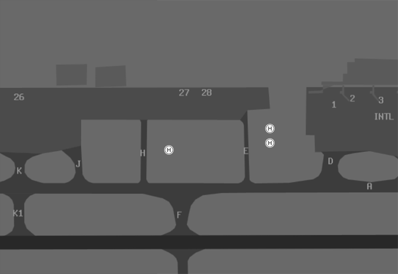

--8<-- "includes/abbreviations.md"

## Positions

| Name                    | Callsign         | Frequency | Login     |
| ----------------------- | --------- | ---------------- | --------- |
| **Port Moresby ADC** | **Jacksons Tower**	| **118.100** | **AYPY_TWR** | 
| **Port Moresby SMC** | **Jacksons Ground** | **121.700** | **AYPY_GND** | 
| **Port Moresby ATIS** | | **128.000** | **AYPY_ATIS**	| 

## Airspace
AYPY ADC is responsible for the Class C Airspace within the AYPY CTR `SFC` to `A020`.

<figure markdown>
{ width="700" }
    <figcaption>Port Moresby ADC Airspace</figcaption>
</figure>

## Maneuvering Area
### Responsibility
**ADC** is responsible for Taxiways **M**, **F**, and **A** beyond the Runway 14R/32L holding points. **ADC** is also responsible for the engine runup bay (the decommissioned section of Runway 14R/32L between Taxiways **L** and **A1**). 

<figure markdown>
{ width="500" }
  <figcaption>AYPY Maneuvering Area Responsibility</figcaption>
</figure>

!!! note
    While Taxiways **A** and **M** do not directly intersect Runway **14R/32L**, they must still be kept clear of traffic for arriving and departing traffic. All aircraft need explicit clearance to cross the Runway **14R/32L** holding points on these taxiways.
	
Unless operationally required, AYPY ADC should consider releasing Runway **14R/32L** to AYPY SMC to minimise the need for coordination.

<!---### Standard Taxi Routes
### Taxiway Restrictions
## Separation-->
## Local Procedures
### Standard Departure Clearances
In lieu of a SID, departing aircraft may be issued with a **Standard Departure Clearance** (SDC). Aircraft cleared via an SDC will depart the circuit visually, and then intercept the track specified by five miles. 

AYPY SMC will clear relevant departures via the appropriate coded SDC, write the departure name in the Global Ops Field.

!!! phraseology
    **AYPY SMC:** "...cleared to Cairns via Departure 56 then KAPSO flight planned route..." 

A list of the Standard Departure Clearances is available in the [AIP Flight Supplement](#charts).

### Daugo Training Area
The AYD901 (Daugo) Danger Area is in the south-west AYPY CTR, `SFC` to `A040`, and is used for flight training and practice approaches.

<figure markdown>
{ width="700" }
    <figcaption>AYD901 (Daugo) Danger Area</figcaption>
</figure>

When activated, the airspace is administered by AYPYA.

## Helicopter Operations
### Helipads and Landing Areas
There are no controlled helipads at AYPY. Multiple uncontrolled helipads have been established on the apron by private operators.

<figure markdown>
{ width="700" }
  <figcaption>Uncontrolled AYPY Helipads</figcaption>
</figure>

Helicopters also operate from multiple points within the city of Port Moresby (which sits entirely within the AYPY CTR) and outlying villages. Notable sites include the Port Moresby General Hospital carpark (2.58NM southwest of ARP) and the Pacific International Hospital (4.57NM southwest of ARP)

These helipads are outside the controlled maneuvering area and do not receive explicit takeoff/landing clearance. Helicopters using these helipads be instructed to 'report on the ground'/'report when airbourne' in lieu of an explicit takeoff/landing clearance.

## Runway Modes
### Runway Selection
The preferred runway direction is Runway 14.

**Runway 14L** shall be used for arrivals and departures when winds favour Runway **14** direction, **or** when:

- Tailwind less than **5 kts**; and
- **By day**; and
- in **VMC**; and
- the runway is **dry**.

In all other conditions, **Runway 32R** shall be used for arrivals and departures.

### Special Runway Operations
#### Parallel Runway Operations
Simultaneous parallel runway operations, including PROPS and SODROPS, are not authorised at AYPY. Departures on parallel runways should be sequenced so that no aircraft is departing simultaneously with a departure or missed approach on the other runway.

!!! warning "Important"
    Separation between traffic on parallel runways is not ensured by SIDs or approach procedures. Aircraft performing a missed approach, or departing Runway **14L/32R** via some SIDs, will turn and cross the extended Runway **14R/32L** centreline.

#### Runway 14R/32L
Runway 14R/32L is the shorter of the two parallel runways and is restricted to aircraft below 23,000KG MTOW. The runway is unlit, and cannot be used at night.

### Circuits
| Runway | Direction |
| ------ | --------- |
| 14L | Left |
| 32R | Right |
| 14R | Right |
| 32L | Left |

## SID Selection
Aircraft planned via **GUNKI**, **LOTGU**, **NUPTA**, **ODOGA**, **RUVKI**, **STARF**, **TOMOM** or **UNSAM** shall be assigned the **Procedural SID** that terminates at the appropriate waypoint. Jet aircraft **not** planned via any of these waypoints shall receive amended routing via the most appropriate SID terminus, unless the pilot indicates they are unable to accept a Procedural SID.

Aircraft departing Runway 14R/32L and aircraft that are unable to accept a Procedural SID may be assigned an [SDC](#standard-departure-clearances), or a visual departure.

## ATIS
### Approach Expectation
If visual approaches are in operation the APCH field must state `EXP VISUAL APCH`.

## Coordination
### Auto Release
'Next' coordination is **not** required to AYPYA for aircraft that are:

- Departing from a runway nominated on the ATIS; and  
- Assigned the standard assignable level; and  
- Assigned a **Procedural** SID.

All other aircraft require a 'Next' call to AYPYA.

The standard assignable level from **AYPY ADC** to **AYPYA** is:

| Aircraft | Level |
| -------- | ----- |
| All | The lower of `A050` and `RFL` |

## Charts
!!! abstract "Reference"
    Charts can be found on the [PNG AIP Flight Supplement](https://www.niuskypacific.com.pg/aip-flight-supplements/){target=new}.