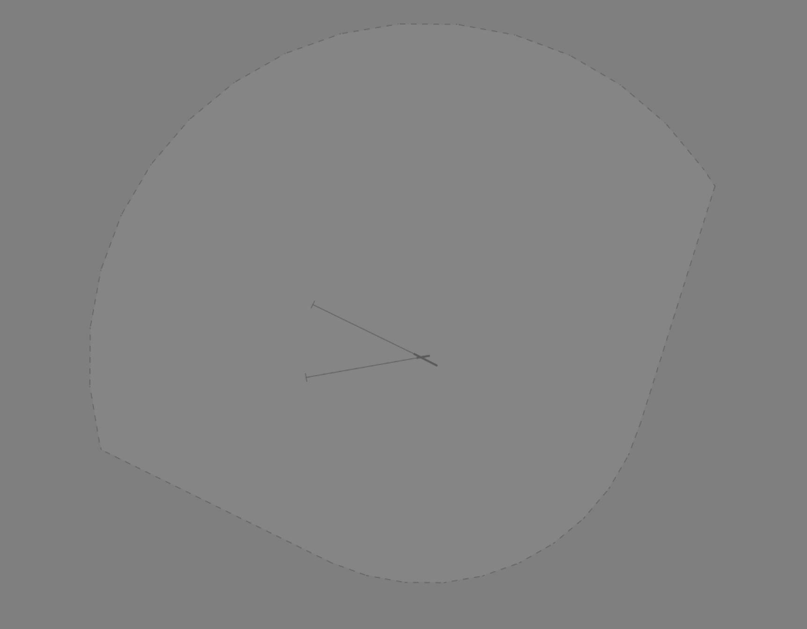
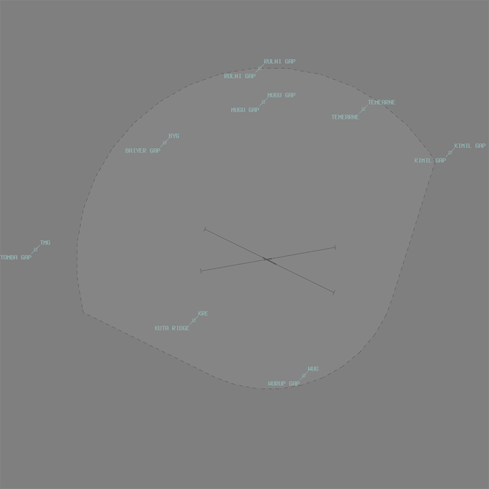

--8<-- "includes/abbreviations.md"

## Positions

| Name | Callsign | Frequency | Login ID |
| ---- | -------- | --------- | -------- |
| **Mount Hagen ADC** | **Hagen Tower**	| **120.500** | **AYMH_TWR** | 
| **Mount Hagen ATIS** | | **128.400** | **AYMH_ATIS**	 |

## Airspace
AYMH ADC is responsible for the **Mt Hagen ATZ**; consisting of Class F airspace `SFC` to `A200`.

<figure markdown>
{ width="700" }
</figure>

Refer to the [PNG Local instructions](../) for more information about Class F/ATZ operations.

<!---
## Maneuvering Area
### Responsibility
### Standard Taxi Routes
### Taxiway Restrictions

## Separation
### Responsibility
## Lateral Separation Points
--->
## Local Procedures
### Start Clearance
Aircraft require clearance from AYMH ADC before engine start.

### Mount Hagen Training Area
The AYD903 (Mount Hagen) Danger Area is in the north-east AYMH ATZ, `SFC` to `A100`, and is used for flight training and practice approaches.

<figure markdown>
{ width="700" }
    <figcaption>AYD903 (Mount Hagen) Danger Area</figcaption>
</figure>

The airspace within the Danger Area remains Class F. AYMH ADC will issue traffic information to aircraft reporting entering and when reporting leaving.

## VFR Operations
### Departure/Arrival Gates
Aircraft should report at the standard VFR Departure/Arrival Gates.

<figure markdown>
{ width="500" }
  <figcaption>AYMH VFR Departure/Arrival Gates</figcaption>
</figure>

| Direction from AYMH | Code | Name | Dep/Arr |
| ------------------- | ---- | ---- | ------- |
| North | - | Rulna Gap | Both |
| North | - | Mugu Gap | Both |
| Northeast | - | Temearne | Both |
| East | - | Kimil Gap | Both |
| South | WUG | Wurup Gap | Both |
| Southwest | KRE | Kuta Ridge | Both |
| West | TMB | Tomba Gap | Both |
| North West | DYG | Diayer Gap | Both |

<!---## Helicopter operations

## SID Selection
## ATIS
--->

## Coordination
### Departures and Arrivals
As per [Standard coordination procedures](../../controller-skills/coordination/#octa-coordination), coordination between AYMH ADC and AYPM is **not required**. However, a **5 minute** change parameter applies to any aircraft that change level, route, or taxi within **5 minutes** of the next sector's airspace.

### Overfliers
As per [Standard coordination procedures](../../controller-skills/coordination/#octa-coordination), coordination between AYMH ADC and AYPM is **not required**. However, a **5 minute** change parameter applies to any aircraft that change level, route, or taxi within **5 minutes** of the next sector's airspace.

IFR aircraft may either be handed off to AYMH ADC frequency by AYPM, or held on the AYPM frequency following coordination if there is no relevant traffic.

!!! phraseology
    *DEF tracking MUDIX H409 OKT*  
    **AYPM** -> **AYMH ADC**: "via IKERU, DEF, any traffic or frequency requirements?"  
    **AYMH ADC** -> **AYPM**: "DEF, No reported IFR traffic, no frequency requirements."  
    AYPM CTR will put *"AYMH NFR NIT"* in the label data, and the aircraft will remain on the ENR frequency.

## Charts
!!! abstract "Reference"
    Charts can be found on the [PNG AIP Flight Supplement](https://www.niuskypacific.com.pg/aip-flight-supplements/){target=new}.