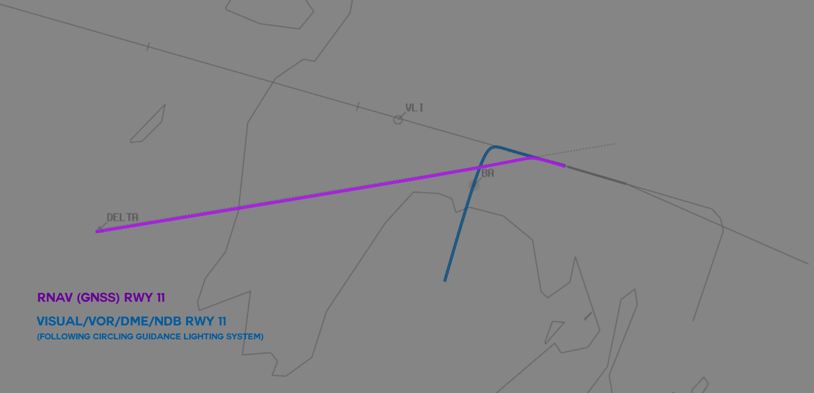

--8<-- "includes/abbreviations.md"

## Positions

| Name                    | Callsign         | Frequency | Login ID    |
| ----------------------- | --------- | ---------------- | --------- |
| **Port Vila ADC**	| **Port Vila Tower**	| **118.300** | **NVVV_TWR**	| 
| **Port Vila ATIS**	| | **126.400** | **NVVV_ATIS**	 	| 

## Airspace
Port Vila ADC is responsible for:
	- The Class D airspace within the NVVV CTR, defined as `SFC` to `A035` within **20nm** of the NVVV ARP, and
	- The Class D airspace within the NVVV TMA, defined as  `A035` to `A095` within **50nm** of the NVVV ARP.
	
<figure markdown>
{ width="700" }
</figure>

Refer to [Class D Tower Separation Standards](../../../separation-standards/classd) for more information.

!!! warning "Important"
    NVVV ADC's airspace exceeds the default visibilty range for the TWR position in VatSys. When logging on to this position, ensure ytour visibility range is set to **50nm**.

<!---## Maneuvering Area Responsibility
## Standard Taxi Routes
## Taxiway Restrictions
#--->
## Local Procedures
### Approach Selection
In **VMC by day**, all aircraft shall be assigned a visual approach.

In all other situations:
- IFR aircraft arriving Runway 29 shall be assigned either the **VOR/DME** or the **RNAV** approach.
- IFR aircraft arriving Runway 11 shall be assigned the **VOR/DME/NDB** approach, or the **RNAV** approach if conditions preclude any other alternative.

### Runway 11
Approaches into Rwy 11 are offset due to terrain.

<figure markdown>
{ width="700" }
</figure>

Aircraft arriving via a **Visual**, **VOR/DME/NDB** approach will follow the Circling Guidance Lighting System to join final approximatey 1.1nm from the runway threshold. Aircraft arriving via the **RNAV** approach will follow an approach track offset by 30°.

!!! note
	The missed approach path for all approaches involves a sharp turn to the south to avoid high terrain to the east of the airport. Take care to ensure positive separation between these aircraft and arrivals from the east.

## VFR Operations
### Training Area
A local training area is established `SFC` to `A040` east of the airport between the Teouma River, the town of Forari, and the coast.

<figure markdown>
{ width="700" }
</figure>

Aircraft on the **VOR** approach to Runway 29 will penetrate the training area on descent, and are **not** vertically separated with aircraft operating in the local training area. When the VOR approach to Runway 29 is in use, aircraft in the training area must advised to keep clear of the extended runway centreline.

<!--Ops Normal Calls?? -->

## Helicopter Operations
There are no specific helicopter movement areas at Port Vila. Helicopters will use aircraft movement areas for all operations.

## Runway Modes
### Circuit Direction
| Runway | Direction |
| ------ | --------- |
| 11 | Right |
| 29 | Left |

## SID Selection
In **VMC by day**, all aircraft shall be assigned a visual departure. 

In all other situations:
- IFR aircraft departing Runway 29 shall be assigned the **NORTH**, **SOUTH**, or **EAST** departure, according to their direction of travel.
- IFR aircraft departing Runway 11 shall be assigned either the **SOUTH** or **VOR** departure, according to their direction of travel.

<!--- ## ATIS --->
## Coordination
### Departures
[Next](../../controller-skills/coordination.md#next) coordination is required from NVVV ADC to NVVV_CTR for all aircraft **entering NVVV CTA**.

The Standard Assignable level from **NVVV ADC** to **NVVV_CTR** is:

| Aircraft | Level |
| -------- | ----- |
| All | The lower of `A090` and `RFL` |

### Arrivals/Overfliers
NVVV_CTR will heads-up coordinate arrivals/overfliers from Class D to NVVV ADC. 

The Standard Assignable level from NVVV_CTR to NVVV ADC is `A100`, any other level must be prior coordinated.

Refer to [Class D Tower Separation Standards](../../../separation-standards/classd) for more information.

<!--- ## Charts --->

